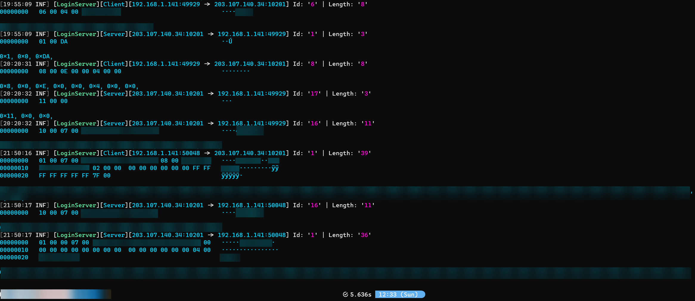

# Pangya Sniffer
Dirty and fastly crafted sniffer for the last standing official server: Pangya TH

## PangCrypt
Thanks to [pixeldesu](https://github.com/pixeldesu) and [john](https://github.com/jchv) for making public a properly working [de/obfuscator](https://github.com/retreev/PangCrypt) for Pangya's packets.

The sniffer has been licensed under GPLv3, making sure to meet the requirements of the port of MiniLzo by Frank Razenberg and the original MiniLzo library by Markus Oberhumer.

## How to use
### Pangya TH sniffing
1. You should first install a Packet capturer on the computer which you want to use the sniffer:
    - On Linux, support for [libpcap](https://www.tcpdump.org/manpages/pcap.3pcap.html)
    - On Windows, support for:
        - Npcap (formerly WinPcap) extensions, see [Npcap API guide](https://npcap.com/guide/npcap-devguide.html#npcap-api)
        - [WinDivert](https://www.reqrypt.org/windivert.html)
2. Then you should build/publish the project named "PangyaSnifferCLI" to generate the proper binaries (if you do not want to install .NET 7.0 SDK on the target computer you should think of making the app [Self-Contained](https://learn.microsoft.com/en-us/dotnet/core/deploying/single-file/overview?tabs=cli))
3. Move those binaries to the computer and run the main binary.
4. Once the CLI starts you should select the device you want to sniff on (it should be the one the client is using to communicate with the server)
5. If any client starts any new TCP connection with the proper "Pangya hellos" it should start to get sniffed (and displayed on the CLI)
### Tinkering it to sniff any other region
Normally, if we are talking about original Pangya clients, the only thing that will change are the "Pangya hellos". You can change/add their detection in the file [PangyaCapturer.cs](https://github.com/Adanlink/pangya-sniffer/blob/main/PcapSniffer/PangyaCapturer.cs)
### Tinkering it to sniff whatever else
If it is a private server, it is possible that they have changed their [CryptoOrcale.cs](https://github.com/Adanlink/pangya-sniffer/blob/main/PcapSniffer/CryptoOracle.cs) or even the obfuscation scheme [Cipher.cs](https://github.com/Adanlink/pangya-sniffer/blob/main/PcapSniffer/Cipher.cs) (you would require to reverse engineer it)

## TODO
As said above, this is just a quickly crafted sniffer, so some desirable things I would have wanted to do are not done.

Maybe some day they will be done ^^'

- [ ] Handle multiple regions by default
- [ ] De-duplicate circular buffers
- [ ] Do GUI
- [ ] Use future repository containing Packet Structures for different Regions